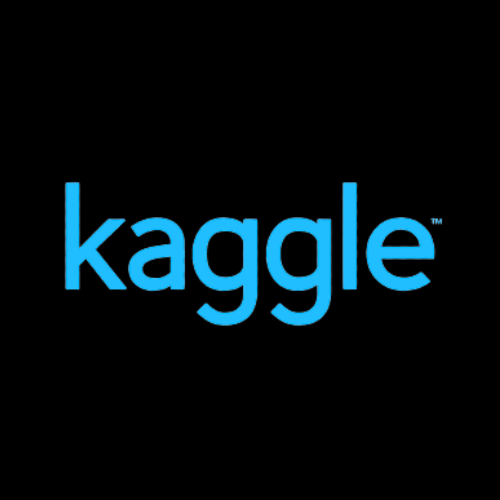

[Projeto Pessoal Utilizando o Banco de Dados Adventure Works, retirado do Kaggle
https://www.kaggle.com/datasets/algorismus/adventure-works-in-excel-tables
A manipulação dos dados foi realizada via SQL Server e o Dashboard foi feito com Power BI.

Em breve ReadMe completo do projeto...](https://www.kaggle.com/datasets/algorismus/adventure-works-in-excel-tables)

# Adventure Works

## 🔎 Problema de Negócio

A Adventure Works é uma empresa que vende produtos esportivos, estando presente em 6 países. No banco de dados constam informações de venda de produtos, categorias e subcategorias, metas, Estados, regiões, países, dentre outras informações. Para melhor compreender o negócio e tomar decisões estratégicas mais informadas, é crucial realizar uma análise aprofundada dos dados da empresa e criar dashboards que respondam às seguintes perguntas:

### 🚲 Visão Produtos

Big Numbers
- Total em Vendas $
- Custo Total $
- Lucro Total $
  
Demais Visualizações
- Produtos mais vendidos
- Quantidade de venda de produtos por Estado
- Relatório geral de produtos
- Categoria de produtos mais rentáveis
- Desempenho de vendas mês a mês
- Lucro por Categoria e Subcategoria
- Top 5 Lucros por Subcategoria
- Top 5 Ofensores por Subcategoria
- Relatório de Lucro por Categoria e Subcategoria

(IMAGEM EM BREVE)

### 🎯 Visão Metas e Lucros

- Lucro mês a mês
- Lucro acumulado mês a mês
- Metas mês a mês

(IMAGEM EM BREVE)

### 🤑 Visão Vendedores

- Metas Alcançadas
- Metas Não Alcançadas
- Relatório Anual Vendedores
- Total vendido por vendedor

(IMAGEM EM BREVE)

## ❗ Premissas do Negócio

- O modelo de negócio adotado é o de venda presencial com metas a serem alcançadas.
- As três principais visões do negócio são: Visão Produtos, Visão Metas e Lucros, Visão Vendedores.

## 💻 Tecnologias e Ferramentas Utilizadas

Este projeto foi desenvolvido utilizando as seguintes tecnologias e ferramentas:

- Linguagem de Programação: SQL Server
- Ferramenta de Desenvolvimento de Dashboards: Power BI
- Plataforma de Hospedagem em Nuvem: GitHub
- Banco de Dados: Kaggle (Adventure Works 2022)
- Outras ferramentas: Excel

  
  
  
  
  

  
## ♟️ Estratégia da Solução

O painel estratégico foi desenvolvido usando métricas que refletem as três principais visões do modelo de negócio da empresa:

1. Visão dos Produtos
2. Visão das Metas e Lucros
3. Visão dos Vendedores

Cada visão é representada por um conjunto específico de métricas, fornecendo insights valiosos para a tomada de decisões estratégicas.

## 💡 Top 3 Insights de Dados

(EM BREVE)

## ✅ Produto Final do Projeto

Desenvolvimento de um painel gerencial (visualização em breve)

## 📊 Conclusão

O objetivo deste projeto é criar um conjunto de gráficos e tabelas que apresentem métricas de forma eficaz para o CEO e outros interessados. As análises fornecem insights cruciais para a tomada de decisões estratégicas.

## ⏭️ Próximos Passos

1. Fazer uma página inicial no Dashboard a fim de facilitar a utilização do painel;
2. Incorporar novas visões de negócio;
3. Explorar a possibilidade de visualização em outras plataformas;
4. Explorar a possibilidade de manipulação dos dados em outra linguagem, como Python ou Excel.

## 🗣️ Contatos:

   

